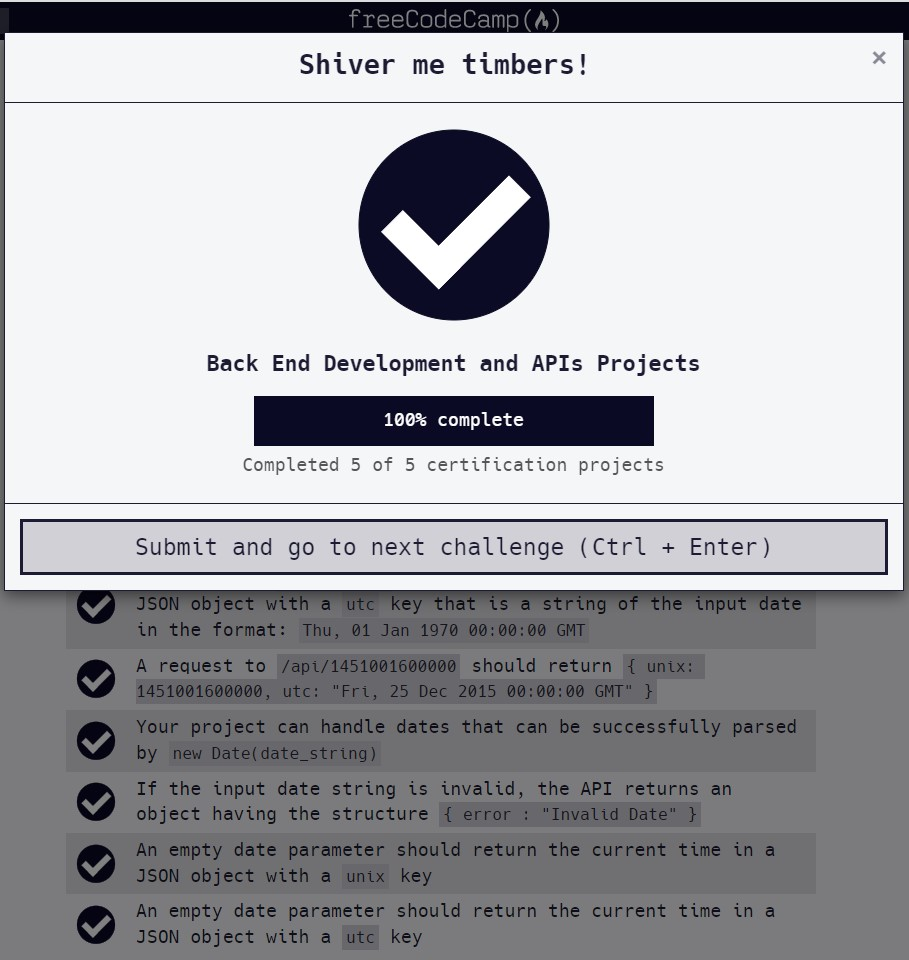

# Timestamp Microservice

#### Documentation can be found on : [https://github.com/viktoriussuwandi/Timestamp-Microservice](https://github.com/viktoriussuwandi/Timestamp-Microservice)

This is the result to complete the Timestamp Microservice project. 
Instructions for building this project can be found at 
[https://www.freecodecamp.org/learn/apis-and-microservices/apis-and-microservices-projects/timestamp-microservice](https://www.freecodecamp.org/learn/apis-and-microservices/apis-and-microservices-projects/timestamp-microservice)

###  Some of additional features :
     * Avoid non date format
     * using Regex to check string date format
     * using toUTCString() function for convertion

### Test Scenario :
- You should provide your own project, not the example URL.
- A request to` /api/:date?` with a valid date should return a JSON object with a `unix` key that is a `Unix timestamp` of the input date in milliseconds (as type Number)
- A request to `/api/:date?` with a valid date should return a JSON object with a `utc` key that is a string of the input date in the format: `Thu, 01 Jan 1970 00:00:00 GMT`
- A request to `/api/1451001600000` should return `{ unix: 1451001600000, utc: "Fri, 25 Dec 2015 00:00:00 GMT" }`
- Your project can handle dates that can be successfully parsed by `new Date(date_string)`
- If the input date string is invalid, the API returns an object having the structure `{ error : "Invalid Date" }`
- An empty date parameter should return the current time in a JSON object with a `unix` key
- An empty date parameter should return the current time in a JSON object with a `utc` key

### Test Result :
